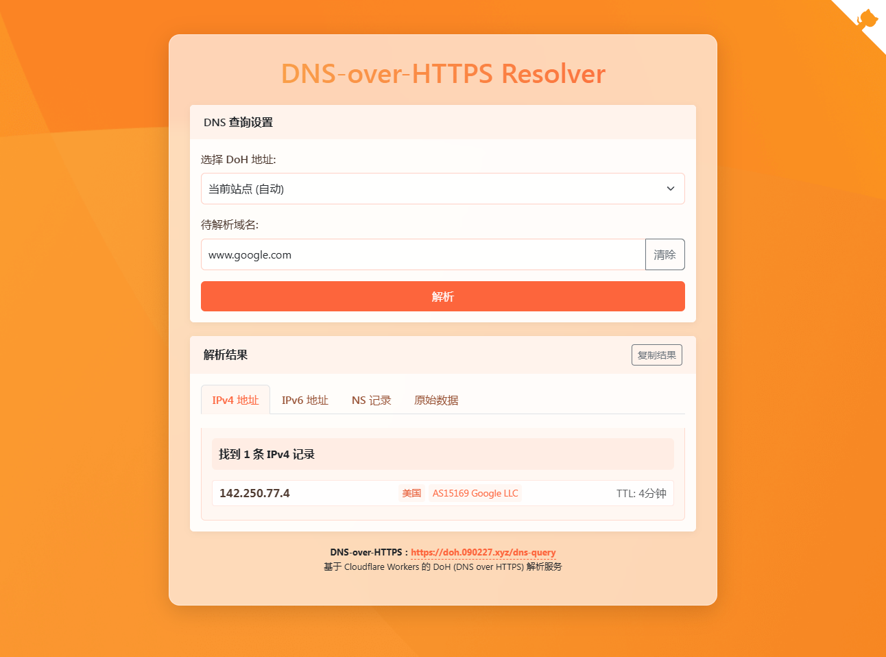

# 📶 CF-Workers-DoH


CF-Workers-DoH 是一个基于 Cloudflare Workers 构建的 DNS over HTTPS (DoH) 解析服务。它允许你通过 HTTPS 协议进行 DNS 查询，提高查询的安全性和隐私保护。

> [!CAUTION]
> **doh.090227.xyz 已被GFW阻断，需自行部署使用。**

> [!WARNING]
> 如需搭建非公益服务，请务必添加`TOKEN`与`URL`变量，`URL`变量推荐为 **nginx** 即可！

## 🚀 部署方式

- **Workers** 部署：复制 [_worker.js](https://github.com/cmliu/CF-Workers-DoH/blob/main/_worker.js) 代码，`保存并部署`即可
- **Pages** 部署：`Fork` 后 `连接GitHub` 一键部署即可

## 📖 使用方法

假设你已部署成功，你的服务域名为：`doh.090227.xyz`

### 1️⃣ DNS解析服务 (DoH)

将以下地址添加到支持DoH的设备或软件中：

```url
https://doh.090227.xyz/dns-query
```

- 还可使用 Cloudflare 回源端口 `2053`、`2083`、`2087`、`2096`、`8443`，例如
```url
https://doh.090227.xyz:2053/dns-query
```

- 如您设置了`TOKEN`变量为 **CMLiussss**，则
```url
https://doh.090227.xyz/CMLiussss
```
### 2️⃣ 附加功能 IP信息查询

#### 🔍 查询当前IP信息
```url
https://doh.090227.xyz/ip-info
```

- 如您设置了`TOKEN`变量为 **CMLiussss**，则
```url
https://doh.090227.xyz/ip-info?token=CMLiussss
```

#### 🔍 查询指定IP信息
```url
https://doh.090227.xyz/ip-info?ip=8.8.8.8
```

- 如您设置了`TOKEN`变量为 **CMLiussss**，则

```url
https://doh.090227.xyz/ip-info?ip=8.8.8.8&token=CMLiussss
```

#### 📝 **返回信息示例**
```json
{
  "status": "success",
  "country": "美国",
  "countryCode": "US",
  "region": "VA",
  "regionName": "弗吉尼亚州",
  "city": "Ashburn",
  "zip": "20149",
  "lat": 39.03,
  "lon": -77.5,
  "timezone": "America/New_York",
  "isp": "Google LLC",
  "org": "Google Public DNS",
  "as": "AS15169 Google LLC",
  "query": "8.8.8.8"
}
```

> 💡 **提示**：请将示例中的 `doh.090227.xyz` 替换为你实际部署的域名

## 🔧 变量说明

| 变量名 | 示例 | 必填 | 备注 | 
|--|--|--|--|
| DOH | `dns.google` |❌| 设置上游DoH服务（默认：`cloudflare-dns.com`） |
| TOKEN | `dns-query` |❌| 设置请求DoH服务路径（默认：`/dns-query`） |
| URL | `https://www.baidu.com/` |❌| 主页伪装(设为`nginx`则伪装为nginx默认页面) |
| URL302 | `https://t.me/CMLiussss` |❌| 主页302跳转 |

> [!TIP]
> 1. 使用 `dns.google` 或 `cloudflare-dns.com` 作为DoH上游时，**解析速度最佳**！
> 2. 使用 `security.cloudflare-dns.com` 作为DoH上游时，可**阻止恶意软件**的DNS解析服务；
> 3. 使用 `family.cloudflare-dns.com` 作为DoH上游时，可**阻止恶意软件**和**成人内容**的DNS解析服务；
> 4. 已知 `doh.pub` **自带污染**，不适合作为DoH上游；
> 5. 目前 `dns.alidns.com` 和 `doh.360.cn` 在**非中国大陆环境**请求DoH时，会下发干净DNS解析服务，也就是**可以作为CF-DoH的上游**，但是**解析速度不佳**。

## 💡 技术特性
- 基于 Cloudflare Workers 无服务器架构
- 使用原生 JavaScript 实现

## 📝 许可证
本项目开源使用，欢迎自由部署和修改！

## 🙏 鸣谢
[tina-hello](https://github.com/tina-hello/doh-cf-workers)、[ip-api](https://ip-api.com/)、Cloudflare、GPT